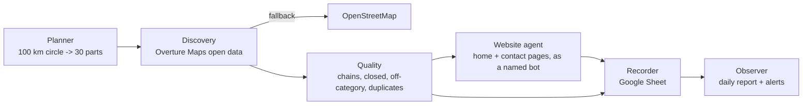

# Plant Parlour Lead Generation (v2)

An automated, multi-agent lead generation system. Every day it works through
one part of a target area (pilot: **Kolkata, 100 km radius, 30 daily parts**),
finds relevant businesses (cafes, restaurants, banquet halls, event planners,
interior designers, landscapers, nurseries/florists, salons & spas, gyms,
clinics, corporate offices, hotels, coworking spaces), collects their
**real** contact routes and writes them to a Google Sheet.

* **Follows the rules (default "open-data" mode).** Leads come only from data
  that is licensed for re-use - [Overture Maps](https://overturemaps.org) places
  (businesses' own Facebook pages via Meta, Microsoft, Foursquare...; CDLA-Permissive-2.0)
  and OpenStreetMap - plus each business's own website, crawled openly as
  *PlantParlourLeadBot* and only where its robots.txt allows. Nothing is
  scraped from Google Maps, Google/Yahoo search, Instagram or Facebook. Two
  opt-in modes go further - *hybrid* (adds web-search + Instagram enrichment)
  and *standard* (adds Google Maps scraping) - see [Rules and licences](#rules-and-licences).
* **No made-up data.** Every phone number, email, WhatsApp, Instagram, Facebook
  or LinkedIn entry was read from a public source and keeps the URL it came
  from (shown in the sheet's *Contact Sources* column). No AI model writes or
  "repairs" contact details.
* **Fully automatic.** It runs every day on GitHub Actions (free, reliable
  internet) and can also run on the Android tablet as a backup.
* **Hard to break.** Every search and every enrichment step is its own durable
  task. One failure (a blocked site, a timeout, Instagram's login wall, a
  Google Sheets error) is recorded on that task and never stops the rest. A
  crash or a killed process resumes where it stopped. If something important
  fails, the GitHub run turns red and GitHub emails you.

## How a day works



1. **Planner**: splits the circle into search squares (1 km in the dense city,
   up to 16 km in the countryside) and groups them into 30 balanced, connected
   parts, centre first. Day *N* of the campaign works part *N*. Parts are
   named after their localities ("Salt Lake / Bidhannagar / ...").
2. **Discovery**: once a month the system downloads the campaign area's
   relevant places from Overture Maps' open data (a few seconds) and then
   answers each square and category from that local copy. The phones, emails
   and Facebook pages the businesses published come with it. OpenStreetMap is
   the fallback. (In *standard* mode it searches Google Maps instead.)
3. **Quality**: drops permanently closed places, national chains (configurable
   list and the data's brand field), off-category results, low-confidence
   listings and duplicates (same place id, or same name within 150 m).
4. **Enrichment** (in parallel): crawls the business's own website (homepage +
   up to 3 contact/about pages, respecting robots.txt) for more emails, phones,
   WhatsApp links and social pages. (Standard mode additionally searches the
   web for Instagram/Facebook/LinkedIn pages, with strict name matching.)
5. **Recorder**: writes one row per business to the *Leads* tab (updates rows
   in place, never duplicates, never overwrites your *Status* column), plus a
   *Plan* tab and a *Daily Report* tab.

A run continues until **today's new leads reach the daily target** and
**today's part is finished**, or the time budget runs out. Unfinished work
carries over automatically. GitHub runs it six times a day (06:07 IST, then every
3 hours until 21:07 IST - GitHub sometimes delays a scheduled run by hours or drops
it, so the later slots catch up); the later runs finish the day's part and then work through the
enrichment queue, and exit quickly when nothing is left. The day's first batch of leads is enriched first, so each day's leads get full contact
details quickly. The **daily target is automatic** by default: on day 1 the system counts the
businesses in the whole area and aims for *area total / number of days* each day (about 1,000/day
for the Kolkata pilot), so the campaign covers the whole area.

Live trials (6 Oct 2026, from GitHub Actions, central Kolkata):

* 20 searches, about 10 minutes: 671 new businesses, 538 leads (phone 530,
  email 172, Instagram 172, WhatsApp 70).
* All 7 categories, 15 searches, 19 minutes: 614 new businesses, 501 leads (phone
  481, Instagram 127, email 45, WhatsApp 18 - most websites were still queued
  when the short test stopped). Planning the 100 km area took 18 seconds.

Google Maps returns far more businesses per search than the daily target, so
the target is normally exceeded while each part is covered.

**Accuracy review.** 150 real rows across all categories were checked by hand. Every
wrong attribution found (a food blogger's page shown as a restaurant's Facebook,
a similarly named cafe's Instagram, a personal profile, a gambling site on an
expired domain, a parent company's accounts) led to a rule and a regression
test; see *Accuracy rules* in [docs/ARCHITECTURE.md](docs/ARCHITECTURE.md).
Uncertain finds are not thrown away: they appear in *Other Contacts
(unverified)* with the reason.

## When something breaks

| If this happens | The system |
|---|---|
| Google Maps throttles or blocks | pauses Maps for that run, uses the Places API (if you add a key) or OpenStreetMap, keeps unfinished searches for the next run; the run turns red if no provider worked |
| Google changes its Maps response format | notices it (records that no longer parse, or only empty answers), keeps the searches instead of marking areas empty, and turns the run red |
| A business website is down or slow | retries that one site later; everything else continues |
| A search engine blocks or changes its page layout | pauses that engine and postpones the Instagram/Facebook lookups to a later run |
| Instagram shows its login wall | skips Instagram bios for that run; Instagram handles are still collected |
| Google Sheets fails | keeps the leads in the encrypted campaign memory and writes them next run; the run turns red |
| A run is cancelled or times out | saves its progress first; the next run continues where it stopped |
| The GitHub machine dies mid-run (nothing saved) | the next run repeats that run's work from the last saved state; leads already copied to the sheet (20-minute checkpoints) are updated, not duplicated |
| GitHub skips a scheduled run | the next of the six daily runs (every 3 hours) continues; the calendar never skips territory |
| The campaign memory is lost | starts over without duplicating sheet rows (rows are matched by Key, Lead IDs are kept) |
| 60 days without commits | the daily *keepalive* job stops GitHub from pausing the schedule |

"Turns red" means the run is marked failed on GitHub, and GitHub emails the
repository owner.

## Quick start

See **[docs/SETUP.md](docs/SETUP.md)** for step-by-step instructions (GitHub
secrets, Google Sheet sharing, enabling the daily schedule, tablet setup).

```bash
pip install -r requirements.txt -r requirements-extra.txt
python -m leadgen doctor                  # check config and secrets
python -m leadgen plan                    # build and print the 30-day plan
python -m leadgen run --budget-minutes 15 --max-searches 10   # small trial
python -m leadgen status                  # progress and lead counts
python -m leadgen export-csv --out leads.csv
```

## What it can and cannot do (honest limits)

| Source | Status (tested 2026-10-06 from GitHub Actions) |
|---|---|
| Overture Maps open data (default source) | Works (tested 2026-10-06): ~30,000 relevant businesses in the 100 km circle across 13 categories, ~95% with a phone, ~60% with an email, ~98% with a Facebook page. Updated monthly. Some listings are stale; low-confidence places are skipped. No ratings. |
| Google Maps search (standard mode only) | Works, more complete (ratings, coworking), but against Google's terms of service. Off by default. |
| Business websites (email, phones, WhatsApp links, social links) | Works; crawls the homepage + /contact, /about etc. and schema.org data. About half of businesses have a website. |
| Web search for Instagram/Facebook/LinkedIn/website | Yahoo works (200+ lookups in a 19-minute run); DuckDuckGo rate-limits after about 1 query (slow backup). Matches must pass the accuracy rules; uncertain ones are marked unverified. |
| Instagram profile bios (emails/phones) | Blocked when logged out from data-centre IPs (HTTP 401). Instagram *handles* are still found via websites, Maps and search. May work on the tablet. |
| LinkedIn emails | Not collected (needs paid tools/login, against LinkedIn's terms). Company page URLs are collected. |
| WhatsApp | Only numbers explicitly published as WhatsApp (wa.me links, "WhatsApp: ..." text). Mobile numbers are labelled *mobile*; WhatsApp registration cannot be verified without WhatsApp's API. |
| OpenStreetMap | Used for planning and as a free fallback; public servers are often slow. |
| Google Places API (official) | Not used: Google's terms forbid saving its names, addresses and phones in our own lists, even through the paid API. |
| Foursquare Places API (official, optional) | Off unless `FOURSQUARE_API_KEY` is set. Fills missing website/phone/socials for a lead. Legal (official API), but Overture already includes Foursquare's data, so it adds little in India. Never returns e-mail. |

## Rules and licences

* **Google.** Google's Maps Platform terms (section 3.2.3) forbid scraping Google Maps and
  "copying and saving business names, addresses, or user reviews" - also through the official,
  paid Places API. So no tool can save Google Maps listings into a sheet within Google's rules.
  The default **open-data** mode therefore does not use Google at all (the sheet only contains a
  Google Maps *search link* per business, which Google allows). Two opt-in modes in
  `compliance.mode`: **hybrid** keeps open-data discovery but adds web-search and Instagram
  enrichment for more contacts (those sites' terms discourage automation - a grey area);
  **standard** also scrapes Google Maps. Turn either on only if you accept that tradeoff.
  Google throttles data-centre IPs, so standard mode is best run from the tablet (home IP).
* **Overture Maps** places are published under CDLA-Permissive-2.0 (and Apache-2.0 for some
  sources): they may be stored and used commercially. If you share the data with someone else
  (e.g. a client), include: *Contains data from the Overture Maps Foundation (CDLA-Permissive-2.0).*
  OpenStreetMap data: *(c) OpenStreetMap contributors (ODbL)*.
* **Websites** are read openly as `PlantParlourLeadBot` (with a link to this repository), only
  where robots.txt allows, slowly (one page every 2 seconds per site), homepage plus at most 3
  contact/about pages.
* **Outreach (later phase).** Business contact details published by the businesses themselves
  may be used for business offers, but India's TRAI rules apply to promotional calls/SMS
  (respect the DND registry), and every email should offer an opt-out.

## Repository layout

```
leadgen/            the system (planner, runner, providers/, enrich/, sheets, report, cli)
config/             campaign configuration (area, categories, targets) - edit this
tests/              offline test suite (fake internet + fake Google Sheets)
.github/workflows/  daily.yml (the automation), ci.yml (tests), probe.yml (live diagnostics)
scripts/ci/         encrypted state save/restore for GitHub Actions
scripts/tablet/     Termux install + daily runner
docs/               SETUP, ARCHITECTURE, AUDIT (what was wrong with the old systems)
```

Outreach (email/WhatsApp/Instagram messages) is a later phase; the sheet's
*Status* column and contact labels are designed for it.
