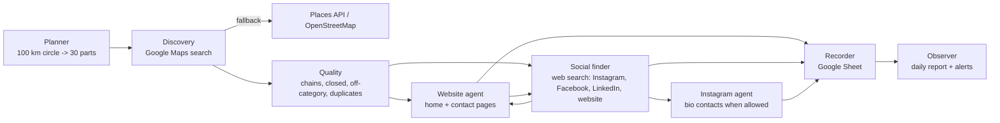

# Plant Parlour Lead Generation (v2)

An automated, multi-agent lead generation system. Every day it works through
one part of a target area (pilot: **Kolkata, 100 km radius, 30 daily parts**),
finds relevant businesses on Google Maps (cafes, restaurants, banquet halls,
event planners, interior designers, hotels, coworking spaces), collects
their **real** contact routes and writes them to a Google Sheet.

* **No made-up data.** Every phone number, email, WhatsApp, Instagram, Facebook
  or LinkedIn entry was read from a public source and keeps the URL it came
  from (shown in the sheet's *Contact Sources* column). No AI model writes or
  "repairs" contact details.
* **Fully automatic.** It runs every day on GitHub Actions (free, reliable
  internet) and can also run on the Android tablet as a backup.
* **Hard to break.** Every search and every enrichment step is its own durable
  task. One failure (a blocked site, a timeout, Instagram's login wall, a
  Google Sheets error) is recorded on that task and never stops the rest. A
  crash or a killed process resumes where it stopped. If something important
  fails, the GitHub run turns red and GitHub emails you.

## How a day works



1. **Planner**: splits the circle into search squares (1 km in the dense city,
   up to 16 km in the countryside) and groups them into 30 balanced, connected
   parts, centre first. Day *N* of the campaign works part *N*. Parts are
   named after their localities ("Salt Lake / Bidhannagar / ...").
2. **Discovery**: searches Google Maps for each category in each square.
   This is the same lightweight endpoint the open-source
   gosom/google-maps-scraper uses, with no browser. Verified live from GitHub
   Actions: 20 businesses per page, paging works, phone numbers on most listings.
3. **Quality**: drops permanently closed places, national chains (configurable
   list), off-category results and duplicates (same Google place, or same name
   within 150 m).
4. **Enrichment** (in parallel): crawls the business's own website (homepage +
   up to 3 contact/about pages, respecting robots.txt), then searches the web
   for its Instagram/Facebook/LinkedIn pages and, if Google Maps had none, its
   website. Search matches are accepted only when the profile name clearly
   matches the business and is not in another city.
5. **Recorder**: writes one row per business to the *Leads* tab (updates rows
   in place, never duplicates, never overwrites your *Status* column), plus a
   *Plan* tab and a *Daily Report* tab.

A run continues until **today's new leads reach the daily target (150)** and
**today's part is finished**, or the time budget runs out. Unfinished work
carries over to the next day automatically.

## Quick start

See **[docs/SETUP.md](docs/SETUP.md)** for step-by-step instructions (GitHub
secrets, Google Sheet sharing, enabling the daily schedule, tablet setup).

```bash
pip install -r requirements.txt -r requirements-extra.txt
python -m leadgen doctor                  # check config and secrets
python -m leadgen plan                    # build and print the 30-day plan
python -m leadgen run --budget-minutes 15 --max-searches 10   # small trial
python -m leadgen status                  # progress and lead counts
python -m leadgen export-csv --out leads.csv
```

## What it can and cannot do (honest limits)

| Source | Status (tested 2026-10-06 from GitHub Actions) |
|---|---|
| Google Maps search (names, phone, website, address, rating, area) | Works. Google may throttle heavy use; the system paces requests and backs off, with fallbacks. |
| Business websites (email, phones, WhatsApp links, social links) | Works; about half of listings have a website. |
| Web search for Instagram/Facebook/LinkedIn/website | Yahoo works; DuckDuckGo rate-limits after about 1 query (slow backup). |
| Instagram profile bios (emails/phones) | Blocked when logged out from data-centre IPs (HTTP 401). Instagram *handles* are still found via websites, Maps and search. May work on the tablet. |
| LinkedIn emails | Not collected (needs paid tools/login, against LinkedIn's terms). Company page URLs are collected. |
| WhatsApp | Only numbers explicitly published as WhatsApp (wa.me links, "WhatsApp: ..." text). Mobile numbers are labelled *mobile*; WhatsApp registration cannot be verified without WhatsApp's API. |
| OpenStreetMap | Used for planning and as a free fallback; public servers are often slow. |
| Google Places API (official) | Optional fallback if you add a key; capped below Google's 1,000 free calls/month. |

Scraping Google Maps is against Google's terms of service. The system keeps
request rates low; the official Places API fallback is available if you prefer.

## Repository layout

```
leadgen/            the system (planner, runner, providers/, enrich/, sheets, report, cli)
config/             campaign configuration (area, categories, targets) - edit this
tests/              offline test suite (fake internet + fake Google Sheets)
.github/workflows/  daily.yml (the automation), ci.yml (tests), probe.yml (live diagnostics)
scripts/ci/         encrypted state save/restore for GitHub Actions
scripts/tablet/     Termux install + daily runner
docs/               SETUP, ARCHITECTURE, AUDIT (what was wrong with the old systems)
```

Outreach (email/WhatsApp/Instagram messages) is a later phase; the sheet's
*Status* column and contact labels are designed for it.
